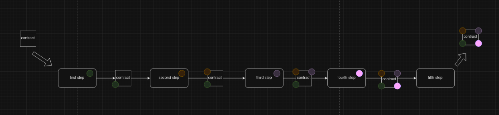

# GO CHAIN PATTERN

Sample of how to build a simple pattern of chain of responsability using arithmetic issue as scenario.

## Flow

Each step do something and then call its next that will do something and so on.
In my example, each step will add some information to contract 'till last step output some information about the chain contract.
